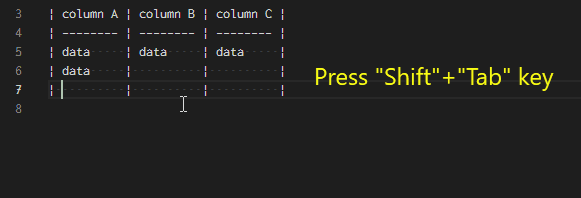

# Markdown Table

Markdown table features.

## 1. Features

| Title                                   | Command                             | Default Keybinding | In the Editor Right Click Menu      |
| :-------------------------------------- | :---------------------------------- | :----------------- | :---------------------------------- |
| Format all tables.                      | markdowntable.format                | Shift + Alt + F    | Yes                                 |
| Convert TSV to table.                   | markdowntable.tsvToTable            | Shift + Alt + T    | Yes (only when selecting range)     |
| Navigate to next cell.                  | markdowntable.nextCell              | Tab                | No                                  |
| Navigate to previous cell.              | markdowntable.prevCell              | Shift + Tab        | No                                  |
| Navigate to next cell (w/o format).     | markdowntable.nextCellWithoutFormat |                    | No                                  |
| Navigate to previous cell (w/o format). | markdowntable.prevCellWithoutFormat |                    | No                                  |
| Insert column in the right.             | markdowntable.insertRight           |                    | Yes (only when not selecting range) |
| Insert column in the left.              | markdowntable.insertLeft            |                    | Yes (only when not selecting range) |
| Align to Left.                          | markdowntable.alignLeft             |                    | Yes                                 |
| Align to Center.                        | markdowntable.alignCenter           |                    | Yes                                 |
| Align to Right.                         | markdowntable.alignRight            |                    | Yes                                 |

---

## 2. Demo

### 2.1. Navigate to next cell (with auto format & auto insert row)

Key binding to `Tab`.

- **Auto navigate to next cell when pressing Tab key in table.**
    - When out of table, vscode's default "tab" behavior is operated.
- **Auto insert new row, when the cursor is in last row in table.**
- with auto format
    - 

#### 2.1.1 Without auto format

- Use markdowntable.nextCellWithoutFormat command
- If you want, you need to assign this command to some key binding by yourself.

### 2.2. Navigate to prev cell

Key binding to `Shift`+`Tab`.

- **Auto navigate to prev cell when pressing Shift+Tab key in table.**
    - When out of table, vscode's default "outdent" behavior is operated.
- with auto format
    - 

#### 2.2.1 Without auto format

- Use markdowntable.prevCellWithoutFormat command
- If you want, you need to assign this command to some key binding by yourself.

### 2.3. Convert to table from TSV text

Key binding to `Shift + Alt + T`.

- **Tips: This feature is supposed to make table from excel cells.**
    - 

### 2.4. Align column/columns

- **Align column to left/center/right.**
    - 

- **Align selected multi columns at once.**
    - 

### 2.5. Format table

Key binding to `Shift + Alt + F`.

- **Auto format column width of all tables in current document**
- Align data and column header (can be disabled by configuration)
    - 

### 2.6. Insert column

- Add context menu to insert column
    - 

## 3. Extension Configurations

| Configuration ID                | Description                                      | Type    | Default |
| :------------------------------ | :----------------------------------------------- | :------ | :------ |
| markdowntable.alignColumnHeader | Align column header in the table when formatting | boolean | true    |
| markdowntable.alignData         | Align data in the table when formatting          | boolean | true    |

## 4. Tips

### 4.1. Add a snippet to create a simple table

You can define user snippets.

- References
    - [Snippets in Visual Studio Code (Official document)](https://code.visualstudio.com/docs/editor/userdefinedsnippets)
- Steps to add a snippet **table** to the global scope
    1. Open snippet file
        1. Select User Snippets under File > Preferences (Code > Preferences on macOS)
        1. Select markdown.json or markdown under New Global Snippets file
    1. Add the following, and save file

        ```json
        {
            "Insert a simple table": {
                "prefix": "table",
                "body": [
                    "|${0:title} |  |",
                    "| - | - |",
                    "|   |   |"
                ],
                "description": "Insert a simple table"
            }
        }
        ```

- Step to add a snippet **table** to the project scope
    1. Create ".vscode/markdown.code-snippets" in your project directory
    1. Add the following, and save file
        - Syntax is almost the same as global, scope option is additional

        ```json
        {
            "Insert a simple table": {
                "prefix": "table",
                "scope": "markdown",
                "body": [
                    "|${0:title} |  |",
                    "| - | - |",
                    "|   |   |"
                ],
                "description": "Insert a simple table"
            }    
        }
        ```

### 4.2. Enable snippets suggestion

By default, the snippets suggestion is disabled in markdown.
You need to enable it to use.

- References
    - [User and Workspace Settings (Official document)](https://code.visualstudio.com/docs/getstarted/settings)
- Step to enable snippets suggestion to the global scope
    1. Open user settings file
        - Windows %APPDATA%\Code\User\settings.json
        - macOS $HOME/Library/Application Support/Code/User/settings.json
        - Linux $HOME/.config/Code/User/settings.json
    1. Add the following, and save file

        ```json
            "[markdown]": {
                "editor.quickSuggestions": true
            }
        ```

- Step to enable snippets suggestion to the project stope
    1. Create (or open if already exist) ".vscode/settings.json" in your project directory
    1. Add the following, and save file

        ```json
            "[markdown]": {
                "editor.quickSuggestions": true
            }
        ```

## 5. Notice

- Tables have to be consisted by using GFM spec
    - a header row, a delimiter row, and zero or more data rows
- leading pipe is needed in each rows
    - NOT support following style

        ```markdown
        abc | defghi
        --- | :--------
        bar | baz 
        ```

## 6. Policy

What's focused on.

- As minimal
    - Not enhance or change markdown syntax spec.
    - Not implement features they can be done by vscode's box selection.
        - [https://code.visualstudio.com/docs/editor/codebasics#_column-box-selection](https://code.visualstudio.com/docs/editor/codebasics#_column-box-selection)
- Support full-width characters
    - Because author is Japanese

## 7. Thanks

Special thanks to contributors.

- [Mark Ferrall](https://github.com/mferrall)
- [heartacker](https://github.com/heartacker)

## 8. Release Notes

- See [changelog](CHANGELOG.md).

## 9. Links

- [Source Code](https://github.com/takumisoft68/vscode-markdown-table)
- [Marketplace](https://marketplace.visualstudio.com/items?itemName=TakumiI.markdowntable)
- [VSX]

## 10. License

Apache 2.0, See [LICENSE](LICENSE) for more information.
